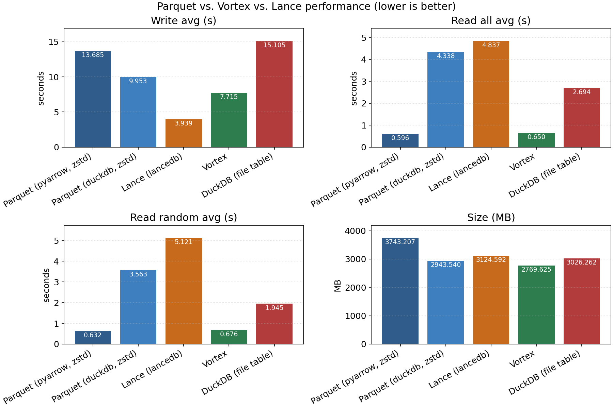
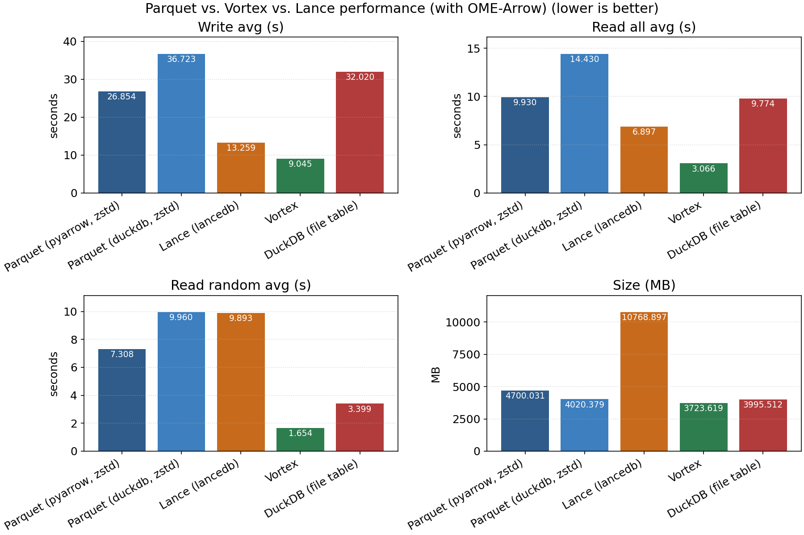
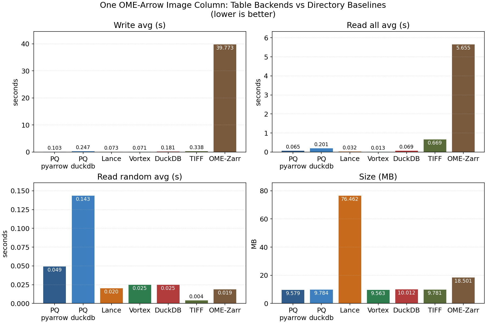
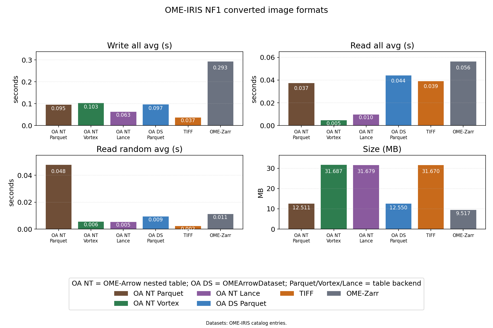
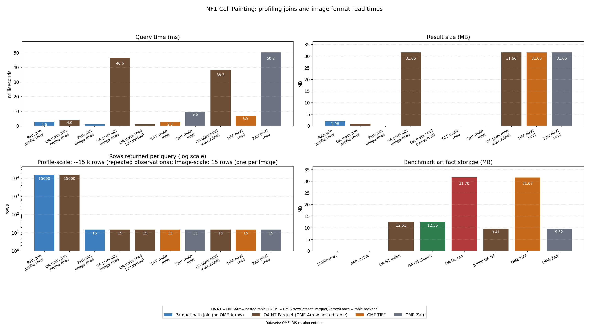
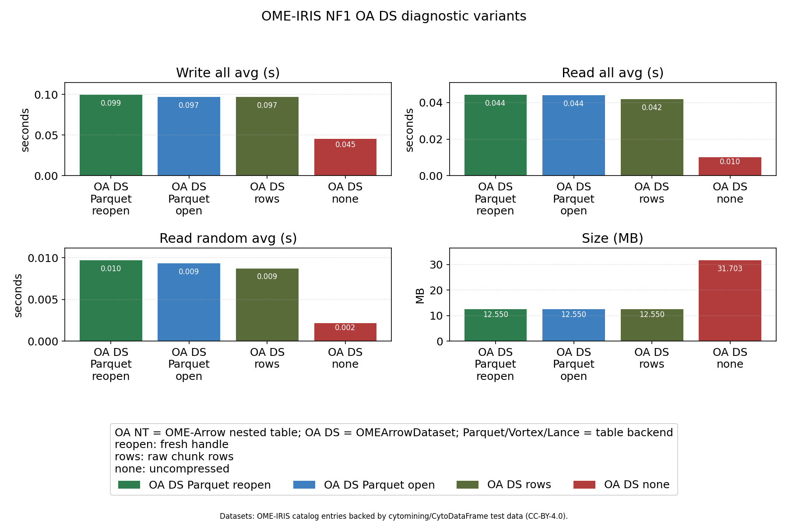
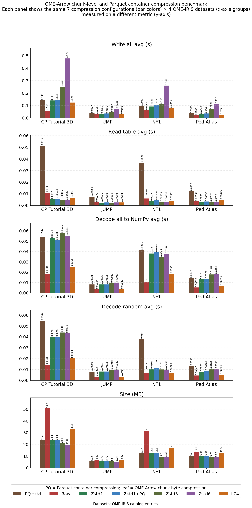
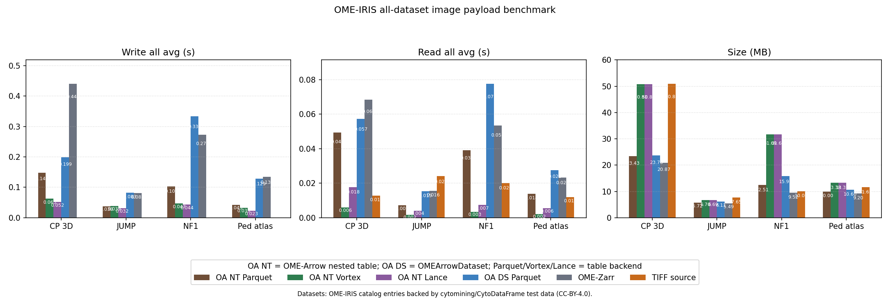
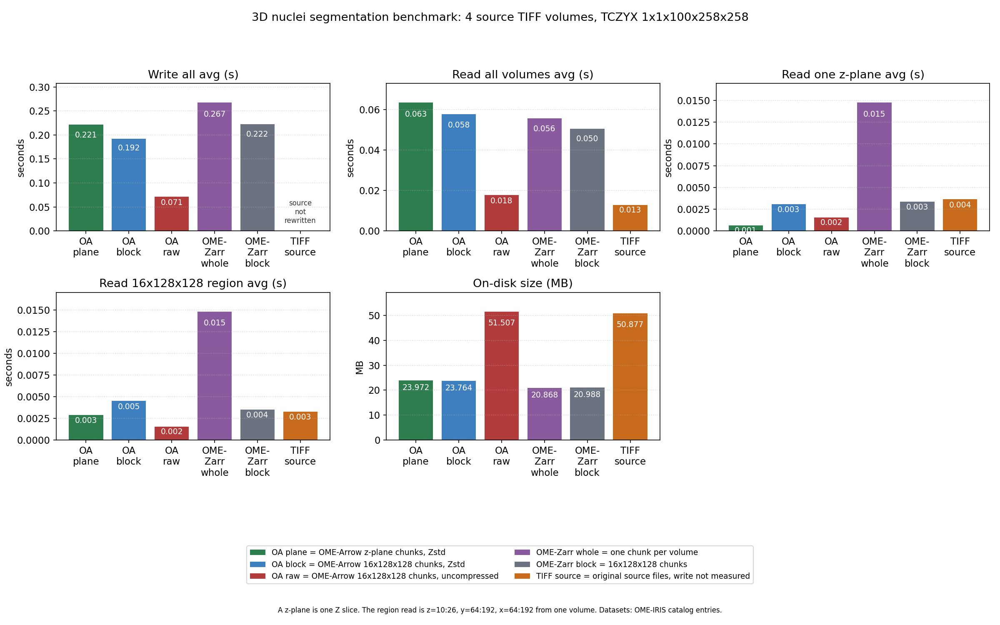

# OME Arrow benchmarks

[](https://doi.org/10.5281/zenodo.18234383)

Benchmarking [OME Arrow](https://github.com/WayScience/ome-arrow) through [Apache Parquet](https://parquet.apache.org), [Vortex](https://github.com/spiraldb/vortex), [LanceDB](https://lancedb.com), and more.

OME-Arrow represents microscopy images and their metadata as native Arrow/Parquet columns.
This lets you run relational queries — joins, filters, aggregations — over bioimage data alongside conventional profiling features, without a separate image server.
Because OME-Arrow is compatible with multiple storage backends, users can swap between Parquet, Vortex, and LanceDB depending on their performance or ecosystem requirements — the image data model stays the same.
These benchmarks quantify the trade-offs: where OME-Arrow is faster, where it is slower, and what drives the difference.

## Benchmark datasets

The real-image benchmarks use four datasets from the [OME-IRIS](https://github.com/WayScience/ome-iris) catalog.
All are small representative subsets drawn from [`cytomining/CytoDataFrame`](https://github.com/cytomining/CytoDataFrame) test data; they are not full plates or full studies.

| OME-IRIS dataset ID         | Images | Channels           | Dimensionality | Description                                                                             | Upstream source                                                                                                                              |
| --------------------------- | ------ | ------------------ | -------------- | --------------------------------------------------------------------------------------- | -------------------------------------------------------------------------------------------------------------------------------------------- |
| `nf1-cellpainting-shrunken` | 15     | 3 (DAPI, GFP, RFP) | 2D             | 5 sites from 1 well of an NF1 fibroblast Cell Painting assay; includes feature profiles | [CytoDataFrame NF1](https://github.com/cytomining/CytoDataFrame/tree/main/tests/data/cytotable/NF1_cellpainting_data_shrunken)               |
| `jump-plate-example`        | 3      | 3 (ch2, ch3, ch5)  | 2D             | 1 field of view from JUMP Cell Painting plate BR00117006                                | [CytoDataFrame JUMP BR00117006](https://github.com/cytomining/CytoDataFrame/tree/main/tests/data/cytotable/JUMP_plate_BR00117006)            |
| `pediatric-cancer-atlas`    | 6      | 3 (ch1, ch2, ch3)  | 2D             | 2 fields from a pediatric cancer atlas Cell Painting plate; includes feature profiles   | [CytoDataFrame pediatric atlas](https://github.com/cytomining/CytoDataFrame/tree/main/tests/data/cytotable/pediatric_cancer_atlas_profiling) |
| `nuclei-3d`                 | 4      | 1                  | 3D             | CellProfiler tutorial 3D noise nuclei segmentation volumes (~13 MB each)                | [CytoDataFrame 3D nuclei](https://github.com/cytomining/CytoDataFrame/tree/main/tests/data/CP_tutorial_3D_noise_nuclei_segmentation)         |

## Key findings

> Read this section for a quick summary. The individual benchmark sections below provide the full picture.

- **Pixel read performance is competitive.** OA NT (OME-Arrow nested table) Vortex is consistently the fastest read format across all tested datasets — often faster than OME-TIFF. OA NT Parquet matches or beats OME-Zarr in every dataset. OA DS (OMEArrowDataset) Parquet is the slowest OME-Arrow variant but remains in the same order of magnitude as the other formats.
- **Storage backend is swappable.** OME-Arrow's compliance with multiple backends — [Apache Parquet](https://parquet.apache.org), [Vortex](https://github.com/spiraldb/vortex), and [LanceDB](https://lancedb.com) — means the same image data model works across ecosystems. Users can choose the backend that best fits their performance profile or tooling without changing how images are represented.
- **Profiling joins are fast.** Joining feature rows to image metadata via an OME-Arrow nested table takes ~4 ms at observation scale (~15 k rows) — comparable to a plain Parquet path join (~3 ms). The small overhead buys structured, queryable image metadata in place of opaque file paths.
- **Pre-converting removes the join at query time, at the cost of upfront conversion.** When profile and image data are co-located in a single OME-Arrow table, metadata reads drop to ~1 ms because no join is performed at query time. Pre-conversion is worth considering for read-heavy workloads where the upfront cost amortises quickly.
- **Chunk-level Zstd-1 is the practical compression default.** Across all tested OME-IRIS datasets, chunk-level Zstd-1 achieves strong size reduction with minimal read overhead. Doubling compression to Zstd-6 shrinks files further but increases write time without meaningfully cutting read time.
- **Reuse the `OMEArrowDataset` handle.** Keeping the handle open across reads is marginally faster than reopening per call, with the clearest benefit on random single-image reads. The difference is small in the tested datasets but the pattern is consistent.

## Benchmarks

### Parquet, Vortex, and LanceDB

These benchmarks establish a baseline over a synthetic wide table representative of Cell Painting feature data (~100 k rows × ~4 k `float64` columns plus ~50 `string` columns).
The three backends — [Apache Parquet](https://parquet.apache.org), [Vortex](https://github.com/spiraldb/vortex), and [LanceDB](https://lancedb.com) — are tested for write, read, and random-access latency.

Results here provide a baseline for comparing the OME-Arrow figures below against purely tabular workloads.



The next figure adds a single OME image column to the same wide-table shape, so the cost of embedding image data into the table can be isolated from the feature-data overhead.



### OME-Arrow and OME-Zarr

Compares table formats that embed a single OME image column, alongside directory-per-image TIFF and OME-Zarr as baselines.

The write, read, and size panels together show that OME-Arrow trades some write/read speed for the ability to query image metadata through SQL or Arrow compute expressions without opening individual files.



### NF1 Cell Painting: image format comparison

This benchmark moves from synthetic data to real NF1 Cell Painting images from the [OME-IRIS catalog](https://github.com/WayScience/ome-iris).
The same 15 images are converted into four formats — OME-Arrow Parquet nested table, `OMEArrowDataset`, OME-TIFF, and OME-Zarr — and then benchmarked for write speed, read speed, and on-disk size.

**How to read this figure:** the bars are grouped by dataset (x-axis) and colored by format. Compare formats within each dataset group to understand relative trade-offs; compare across dataset groups to check whether the pattern holds for different image types and sizes.

OA NT and OA DS are competitive with OME-TIFF and OME-Zarr for write time.
Write time for OME-TIFF here reflects conversion from source TIFF to OME-TIFF — in later benchmarks where TIFF is used as the source reference rather than a conversion target, it has no write bar.
For read time, OME-TIFF has an advantage for raw pixel throughput because it avoids Arrow's struct materialization overhead.
File size varies by dataset because OME-IRIS datasets differ in image count, resolution, and bit-depth — they are not directly normalized per image here.



### NF1 profiling joins and image format read times (detail)

Breaks the NF1 experiment into individual operations across four panels: query time, in-memory result size, rows returned per query, and benchmark artifact storage.

**Query time (top-left):** path joins and OA metadata joins are both in the low-millisecond range at profile scale (~15 k rows). The pre-converted OA metadata scan is fastest. Payload operations — materializing full pixel arrays — are 10–40× slower than metadata operations and dominate the right side of the bar chart.

**Result size (top-right):** metadata operations return small result tables (kilobytes). Payload operations materialize the full pixel arrays in memory; the OME-Arrow path allocates more memory than TIFF or Zarr because of Arrow's nested struct representation.

**Rows returned (bottom-left):** the row counts differ because two access patterns are present. Operations labeled "profile rows" join at observation scale (~15 k repeated feature rows); "image rows" operations return one row per real image (15). The log scale is needed to show both on the same axis.

**Artifact storage (bottom-right):** shows how much disk space each converted artifact requires. The OME-Arrow image index, converted profile-image table, OME-TIFF files, and OME-Zarr groups are all within a factor of 3 of each other for this dataset.



### OME-Arrow Dataset read strategies

These four configurations hold the image data constant and vary only how the `OMEArrowDataset` API is used: open the handle once or reopen per call; Zstd-compressed chunks or uncompressed.

| Bar label                                | Meaning                                                           |
| ---------------------------------------- | ----------------------------------------------------------------- |
| OA Dataset zstd reopen each call         | New `OMEArrowDataset` handle opened per read                      |
| OA Dataset zstd keep handle open         | Single `OMEArrowDataset` handle reused across all reads           |
| OA Dataset zstd chunk-row API            | Raw chunk-row access (returns Arrow table rows, not NumPy arrays) |
| OA Dataset uncompressed keep handle open | No Zstd compression; handle kept open                             |

**Takeaway for practitioners:** "keep handle open" is marginally faster than "reopen each call", with the most consistent benefit on random single-image reads.
Uncompressed chunks read faster still, but at the cost of larger files on disk.
The chunk-row API returns raw Arrow table rows rather than decoded NumPy arrays; it is faster for inspection but not directly comparable for pixel-processing workflows.



### Leaf compression sweep

Sweeps seven combinations of chunk-level byte compression (none, Zstd-1, Zstd-3, Zstd-6, LZ4) and Parquet container compression (none, Zstd) across all four OME-IRIS datasets.
All five panels show the same data — the same 7 compression configurations applied to the same 4 datasets — with each panel measuring a different aspect: write time, read-table time, full-decode time, random-decode time, and file size.

**How to read this figure:** start with the size panel (last row) to understand the compression trade-off, then check the write and decode panels to see the speed cost.

Key observations:

- Adding Parquet container compression on top of chunk-level compression (Zstd1+PQ) does not meaningfully reduce file size compared to chunk-level Zstd-1 alone, and adds write overhead.
- Higher Zstd levels (3, 6) shrink files further but with rapidly diminishing returns on read speed.
- LZ4 is the fastest to compress and decompress but achieves less size reduction than Zstd-1.
- The uncompressed baseline ("Raw") has the fastest decode time but the largest files.

For most use cases, **chunk-level Zstd-1 with no Parquet container compression** is the recommended default.



### All OME-IRIS image and data collections

Runs the same write/read benchmark across all four datasets in the OME-IRIS catalog simultaneously.
This tests whether the patterns from the NF1-focused benchmarks above generalize to the JUMP plate, Pediatric Cancer Atlas, and the 3D CellProfiler tutorial images.

**What to look for:** consistent format ordering across datasets. Differences in absolute numbers between datasets reflect real differences in image count, resolution, and dimensionality — not benchmark noise.
TIFF appears as a read-only reference (no write bar) because it is the source format; it is not being converted.



### 3D nuclei segmentation

Extends the benchmark to 3D volumetric images using a CellProfiler tutorial dataset of 3D noise nuclei segmentation volumes.
Three access patterns are measured: full-volume read, single z-plane read, and a small sub-volume region read (z=10:26, y=64:192, x=64:192).

OME-Arrow supports two chunk layouts for 3D data: **z-plane** (one Arrow row per Z slice, optimized for plane-by-plane access) and **block** (fixed 3D blocks, optimized for sub-volume queries).
Zarr is tested with whole-image and block chunk configurations for comparison.

**What to look for:** for z-plane reads, the z-plane layout is most efficient; for sub-volume reads, the block layout wins.
Full-volume reads favor Zarr with large chunks because it avoids the row-iteration overhead that OME-Arrow incurs when reading all rows.
TIFF has no write step and no native sub-volume access — it reads the whole volume every time.



## Running benchmarks

1. Create and sync a uv environment (includes parquet, lancedb, vortex-data):

```bash
uv venv
uv sync
```

2. Run individual benchmark scripts:

```bash
uv run python <benchmark file>
```

The benchmarks default to ~100,000 rows × ~4,000 columns of `float64` data and ~50 columns of `string` data. Lower `N_ROWS`/`N_COLS` in the config cell if you hit memory pressure (especially before converting to pandas for the CSV benchmark).

An OME-Arrow variant lives at `notebooks/compare_parquet_vortex_lance_ome.py` which adds a single OME image column (random 100x100) alongside the existing columns.

An OME-Arrow-only + OME-Zarr benchmark lives at `src/benchmarks/compare_ome_arrow_only.py`, focusing on table formats that store one OME image column plus directory-per-image TIFF and OME-Zarr comparisons.

## Additional validation benchmarks

These benchmark scripts provide broader coverage over real imaging datasets and are useful for validating results beyond the smaller synthetic and single-image benchmarks.
They are intentionally listed last because they are a larger validation suite rather than the baseline benchmark entry point.

Run the main OME-IRIS comparison with:

```bash
uv run python src/benchmarks/compare_ome_iris_joins.py
```

The real-image benchmark scripts are:

- `src/benchmarks/compare_ome_iris_joins.py`: NF1 joins, converted image formats, and 3D nuclei access.
- `src/benchmarks/compare_ome_iris_all_images.py`: all image datasets in the local OME-IRIS catalog.
- `src/benchmarks/compare_ome_iris_leaf_compression.py`: nested-table leaf byte compression sweep.

### Dataset sources

The OME-IRIS benchmark scripts fetch datasets from the installed `ome-iris` catalog manifests.
See the [Benchmark datasets](#benchmark-datasets) section at the top for full details on each dataset.
