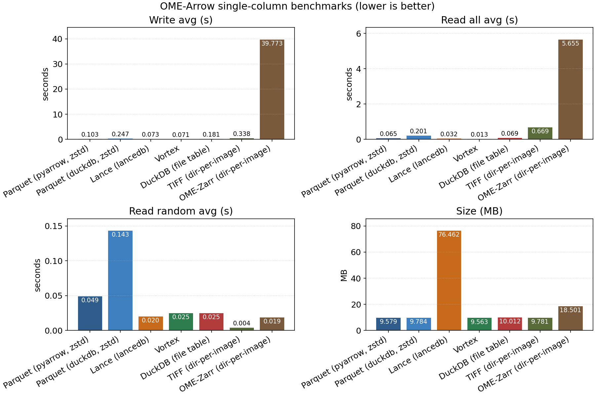
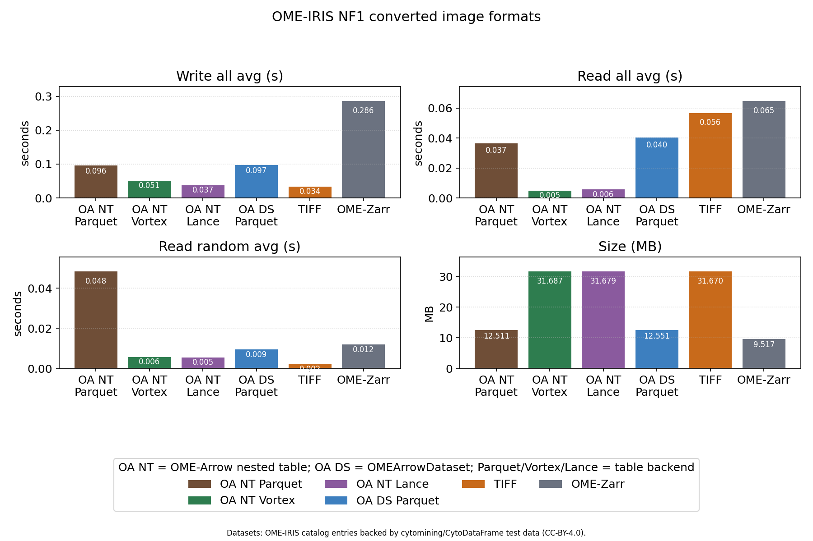
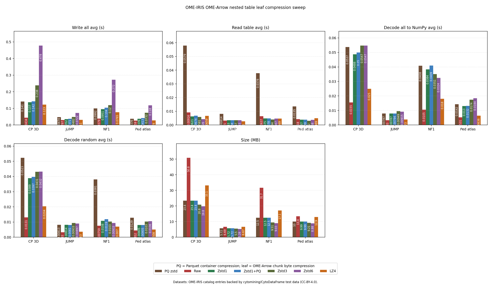
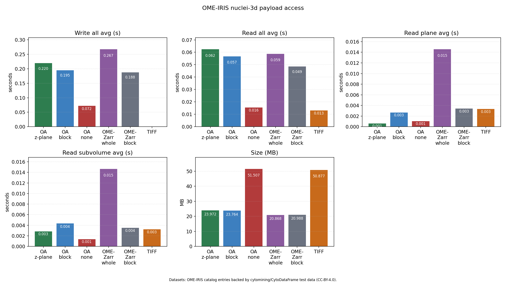
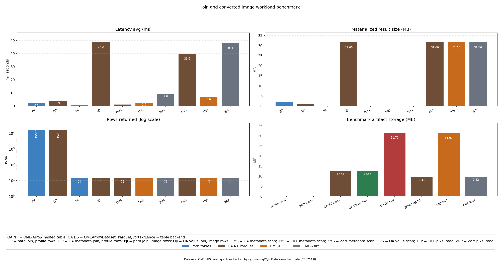
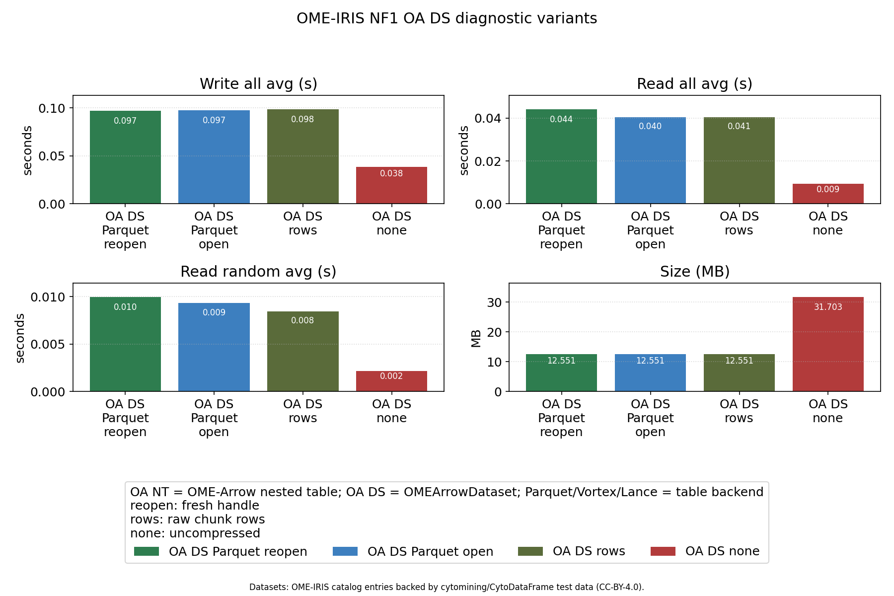

# OME Arrow benchmarks

[](https://doi.org/10.5281/zenodo.18234383)

Benchmarking [OME Arrow](https://github.com/WayScience/ome-arrow) through Parquet, Vortex, LanceDB, and more.

## Benchmarks

### Parquet, Vortex, and Lance

Wide-table benchmark results for the generic storage backends.


The OME-Arrow variant adds a single OME image column to the same wide-table
benchmark shape.


### OME-Arrow and OME-Zarr

Smaller OME-Arrow-only benchmark focused on a single OME image column and a
directory-per-image OME-Zarr comparison.



### Real image validation plots

These plots are a broader validation suite over real image bundles. They are
useful after inspecting the smaller benchmark outputs above.

NF1 Cell Painting write-all, read-all, read-random, and size comparisons:



Nested-table leaf byte compression compared with Parquet container compression:



All local OME-IRIS image bundles:


3D nuclei access patterns:



Join detail and OA DS diagnostics:





## Running benchmarks

1. Create and sync a uv environment (includes parquet, lancedb, vortex-data):

```bash
uv venv
uv sync
```

2. Launch Jupyter and open `notebooks/compare_parquet_vortex_lance.ipynb`:

```bash
uv run python <benchmark file>
```

The benchmarks defaults to ~100,000 rows x ~4,000 columns of `float64` data and ~50 columns of `string` data. Lower `N_ROWS`/`N_COLS` in the config cell if you hit memory pressure (especially before converting to pandas for the CSV benchmark).

An OME-Arrow variant lives at `notebooks/compare_parquet_vortex_lance_ome.py` which adds a single OME image column (random 100x100) alongside the existing columns.

An OME-Arrow-only + OME-Zarr benchmark lives at `notebooks/compare_ome_arrow_only.pyt`, focusing on a single OME image column and a directory-per-image OME-Zarr comparison.

## Additional validation benchmarks

These benchmark scripts provide broader coverage over real image bundles and are
useful for validating results beyond the smaller synthetic and single-image
benchmarks. They are intentionally listed last because they are a larger
validation suite rather than the baseline benchmark entry point.

Run the main OME-IRIS comparison with:

```bash
uv run python src/benchmarks/compare_ome_iris_joins.py
```

The real-image benchmark scripts are:

- `src/benchmarks/compare_ome_iris_joins.py`: NF1 joins, converted image
  formats, and 3D nuclei access.
- `src/benchmarks/compare_ome_iris_all_images.py`: all image bundles in the
  local OME-IRIS catalog.
- `src/benchmarks/compare_ome_iris_leaf_compression.py`: nested-table leaf byte
  compression sweep.

### Dataset sources

The OME-IRIS benchmark scripts fetch datasets from the installed `ome-iris`
catalog manifests. Those manifests currently point to
[`cytomining/CytoDataFrame`](https://github.com/cytomining/CytoDataFrame) test
data and declare `CC-BY-4.0` licensing.

| OME-IRIS dataset ID | Local source identifier | Upstream source |
| --- | --- | --- |
| `nf1-cellpainting-shrunken` | `NF1_cellpainting_data_shrunken` | [CytoDataFrame NF1 Cell Painting shrunken](https://github.com/cytomining/CytoDataFrame/tree/main/tests/data/cytotable/NF1_cellpainting_data_shrunken) |
| `jump-plate-example` | `JUMP_plate_BR00117006` | [CytoDataFrame JUMP plate BR00117006](https://github.com/cytomining/CytoDataFrame/tree/main/tests/data/cytotable/JUMP_plate_BR00117006) |
| `pediatric-cancer-atlas` | `pediatric_cancer_atlas_profiling` | [CytoDataFrame pediatric cancer atlas profiling](https://github.com/cytomining/CytoDataFrame/tree/main/tests/data/cytotable/pediatric_cancer_atlas_profiling) |
| `nuclei-3d` | `CP_tutorial_3D_noise_nuclei_segmentation` | [CytoDataFrame 3D nuclei example](https://github.com/cytomining/CytoDataFrame/tree/main/tests/data/CP_tutorial_3D_noise_nuclei_segmentation) |
